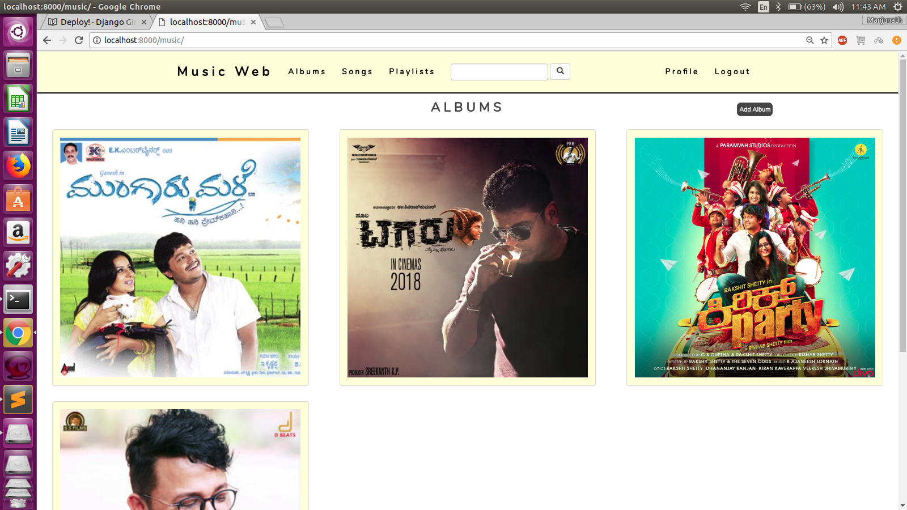
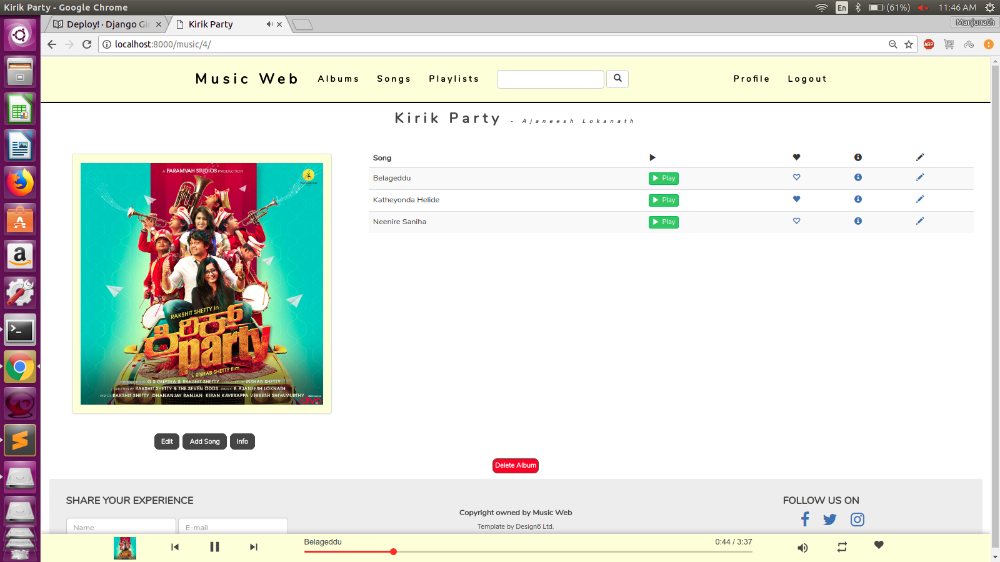
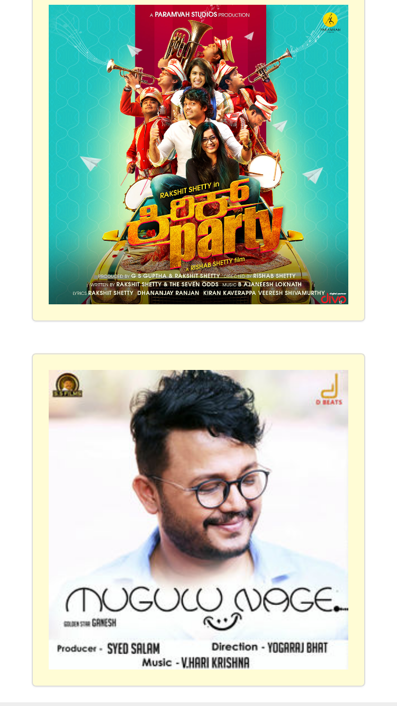
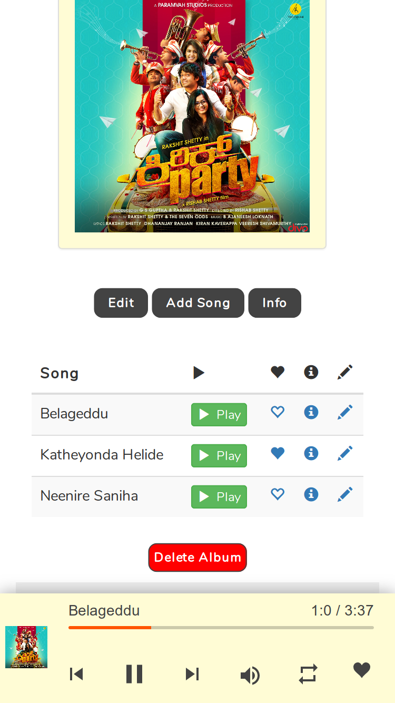
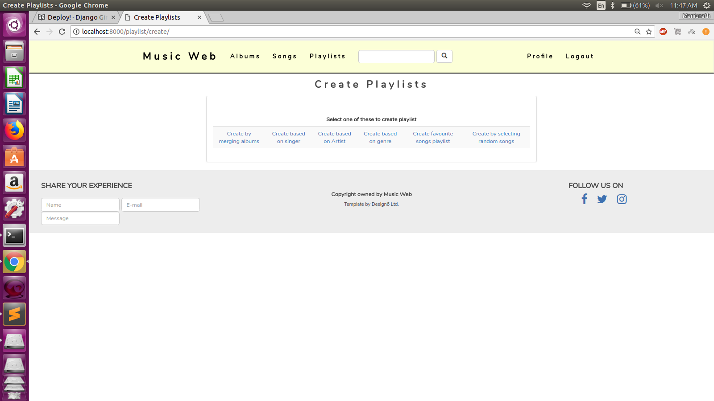

# Music-Web
A cloud based customizable music player website developed in django and javascript.

## Features
* Customized audio player developed in javascript
* Mobile responsive website built with bootstrap with some of its features tweaked
* Search bar to search for any song in any album

## Audio player features
* Multiple songs can added to queue
* Access songs in queue by pressing next and previous buttons
* Can play the song in loop by pressing repeat button

## Album features
* User can create, edit and delete Albums
* User can add any number of songs to it from his computer or mobile

## Playlist features
* User can create, edit and delete Playlists
* Create playlist has 6 different options for creating playlists
  - Can create playlist by merging different albums
  - Can create playlist based on singer
  - Can create playlist based on music director
  - Can create playlist based on genre of music
  - Can create favourite songs playlist
  - Can create playlist by selecting random songs
  

